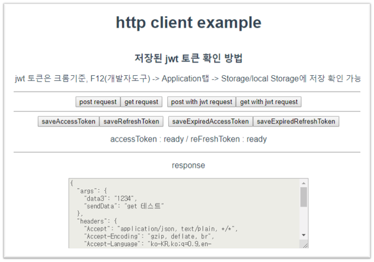

# vue-http-client
Vue 개발시 대부분의 api서버와 통신하는 로직이 필요합니다.\
이때 vue 파일마다 http요청 코드를 중복으로 사용하지 않도록 axios를 패키징하여 별도 서비스 로직에서 사용하기 편하도록 만들어봤습니다.\
추가적으로 OAuth를 사용하는 서비스를 개발할때도 대응할 수 있도록 만들어졌습니다.


### Project setup
```
git clone https://github.com/parkjungwoong/vue-http-client.git
npm install
```

### Run dev server
```
npm run serve
```

### Run test
```
npm run test:unit
```

### 구성
vue-cli를 이용한 기본 예제 프로젝트 기반으로 만들어졌습니다.
```
└─src
    ├─assets
    ├─common     // 공통 유틸리티 메소드
    ├─components // 뷰 컴포넌트
    └─service    // 서비스 로직
    
└─tests          //테스트 코드          
    └─unit       
        └─common  
```

### 호출방식
service 로직을 작성 후 Vue에서 호출하는 방식으로 개발하여 뷰와 서비스 로직을 분리합니다.

service 로직에서 http 요청시 아래와 같이 호출하여 사용합니다.
```javascript
/**
* exService.js
* 비지니스 로직을 분리하여 여기에 작성합니다.
*/
import http from '../common/httpUtil'

let service = {
    async exService(param) {
        //데이터 벨리데이션 및 가공처리, param 변경시 object 복사 후 사용, 서비스에서 param 변경시 vue도 같이 변경
        let res = {};
        try {
            res = await http.post('/post',param);
        } catch (e) {
            throw e;
        }
        return res;
    }
}
export default service;
```

Vue에서 아래와 같이 service를 호출하여 중복 코드를 최소화 합니다.
```javascript
/**
* ex.vue
* 비지니스 로직은 서비스에서 호출하여 사용합니다.
*/
import exService from '../service/exService'

export default {
        name: 'HelloWorld',
        ... 생략
        
        methods: {
            test() {
                //import한 서비스의 함수를 호출하여 사용한다.
                let result = exService.somethig();
                this.msg = result.msg;
            }
        }
}
```
## 주요 유틸 함수

### http 요청 처리
/src/common/httpUtil.js 파일
```javascript
    init(newHeader){
        //axios 객체 생성, 타임아웃, 해더,등 요청에 필요한 공토 정보 세팅
    },
    async post(url, param, newHeader) {
        //post 요청
    },
    async get(url, param, newHeader) {
        //get 요청
    },
    async postJwt(url, param, token) {
        //jwt 토큰을 해더에 세팅 후 post 요청
    },
    async getJwt(url, param, token) {
        //jwt 토큰을 해더에 세팅 후 get 요청
    },
    async setAuthHeader(token) {
        //jwt 토큰 세팅된 해더 생성, jwt 토큰 유효성 체크
    },
    httpSuccessHandler(res) {
        //api 성공 응답시 공통 처리할 부분
    },
    httpErrHandler(err) {
        //api 실패 응답시 공통 처리할 부분
    }
```
### jwt 토큰 관리
/src/common/jwtUil.js 파일
```javascript
    setAccessToken(token) {
        //로컬 저장소에 엑세스 토큰 저장 
    },
    async getAccessToken() {
        //로컬 저장소에서 엑세스 토큰 반환
        //엑세스 토큰 만료시 갱신 후 반환 처리 함
    },
    setRefreshToken(token) {
        //로컬 저장소에 리프레시 토큰 저장
    },
    getRefreshToken() {
        //로컬 저장소에서 리프레시 토큰 반환 
    },
    isExpiredToken(token) {
        //토큰 만료기간 확인
    },
    getPayLoad(token) {
        //토큰 payload 정보 반환
    },
    async tokenRefresh() {
        //엑세스 토큰 갱신
    }
```


